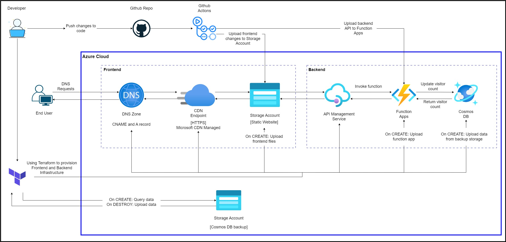

# Azure Cloud Resume Challenge

This is my output for the [Cloud Resume Challenge](https://cloudresumechallenge.dev/), hosted on the Azure Cloud Platform.

## Challenge Overview

The challenge involves:
- Deploying a static website
- Implementing a visitor counter
- Utilizing various Azure services for:
  - Hosting
  - Security
  - Backend
  - DNS management
- Implementing Infrastructure as Code (IaC)
- Implementing CI/CD pipelines

## Visit My Website

[www.imneojay.xyz](https://www.imneojay.xyz/)

## Diagram

  

## Website Hosting
- The static website is hosted on 
  [Azure Storage](https://learn.microsoft.com/en-us/azure/storage/blobs/storage-blob-static-website).
- Azure Storage provides a cost-effective and scalable solution for hosting 
  static websites.
- The website also includes a visitor counter to track the number of visits.
- Learn more about hosting static websites on Azure Storage 
  [here](https://docs.microsoft.com/en-us/azure/storage/blobs/storage-blob-static-website).

## Frontend
- The website is built using 
  [HTML](https://developer.mozilla.org/en-US/docs/Web/HTML), 
  [CSS](https://developer.mozilla.org/en-US/docs/Web/CSS), and 
  [JavaScript](https://developer.mozilla.org/en-US/docs/Web/JavaScript).
- These technologies create a responsive and interactive user interface.
- You can find tutorials for these technologies on 
  [MDN Web Docs](https://developer.mozilla.org/en-US/).

## Backend
- The backend API, responsible for the visitor counter, is written in Python 
  and deployed using 
  [Azure Functions](https://learn.microsoft.com/en-us/azure/azure-functions/functions-overview).
- Azure Functions is a serverless compute service that enables running code 
  on-demand without having to manage infrastructure, allowing for efficient 
  and scalable backend processing.
- This Azure Function retrieves data from 
  [Azure Cosmos DB](https://learn.microsoft.com/en-us/azure/cosmos-db/introduction) 
  via the Python SDK and updates it every time a visitor comes in.
- Learn more about 
  [Azure Functions with Python](https://docs.microsoft.com/en-us/azure/azure-functions/functions-reference-python) 
  and integrating 
  [Azure Cosmos DB](https://docs.microsoft.com/en-us/azure/cosmos-db/sql-api-python-samples).

## Security
- For enhanced security, I used 
  [Azure Content Delivery Network (CDN)](https://learn.microsoft.com/en-us/azure/cdn/cdn-overview) 
  to serve requests as HTTPS traffic.
- Azure CDN helps in improving the performance and security of the website by 
  distributing the content closer to the users.
- Learn more about 
  [securing your web app with Azure CDN](https://docs.microsoft.com/en-us/azure/cdn/cdn-ssl-features).

## DNS Management
- [Azure DNS](https://learn.microsoft.com/en-us/azure/dns/dns-overview) is utilized 
  alongside a DNS registrar for efficient management of domain names.
- I added a custom domain function and verified it on my domain registrar 
  (DreamHost) by adding CNAME records.
- Learn more about 
  [configuring custom domain names in Azure](https://docs.microsoft.com/en-us/azure/app-service/app-service-web-tutorial-custom-domain).

## Infrastructure as Code
- I have used [Terraform](https://www.terraform.io/) to provision and manage the 
  infrastructure required for this project.
- This approach ensures that the infrastructure is defined as code, making it easy 
  to reproduce and manage.
- On destroy, I have added a function to backup the data from CosmosDB and upload 
  it to an Azure Storage account.
- This backup is then queried on creation and uploaded to CosmosDB for the data.
- Learn more about using 
  [Terraform with Azure](https://learn.hashicorp.com/collections/terraform/azure-get-started).

## CI/CD Pipelines
- I used [GitHub Actions](https://github.com/features/actions) to automate the delivery 
  of changes to the frontend and backend configurations.
- By registering a service principal and adding an RBAC contributor role, I have configured 
  a frontend workflow to deliver changes to the frontend when pushing to GitHub.
- This frontend workflow also purges the CDN cache to ensure changes are reflected in production 
  as soon as possible.
- For the backend, I used the publish profile of the Azure Functions to authenticate to Azure.
- The backend workflow uploads changes from the backend API code to the Azure Function when 
  pushing on GitHub.
- Learn more about [GitHub Actions](https://docs.github.com/en/actions) and 
  [CI/CD for Azure Functions](https://docs.microsoft.com/en-us/azure/azure-functions/functions-how-to-github-actions).
